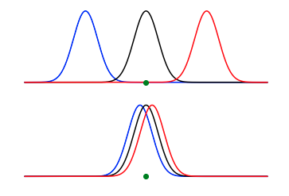

# The idea behind the test

In the previous two tasks, we have introduced the __error sum of squares__, which was defined as follows:

S_j^2\qquad\textrm{where}S_j^2=\frac{n_j}{n_j-1}\left[\frac{1}{n_j}\sum_{i=1}^{n_j}X_i^2-\left(\frac{1}{n_j}\sum_{i=1}^{n_j}X_i\right)^2\right])

and the __treatment sum of squares__, which was defined as follows:

^2\qquad\textrm{where}\qquad\overline{X}_j=\frac{1}{n_j}\sum_{i=1}^{n_j}X_i\qquad\textrm{and}\qquad\overline{X}=\frac{1}{t}\sum_{j=1}^t\overline{X}_j)

It is also worth introducing the __total corrected sum of squares__ () and noting that*:

^2 = SS_E + SS_T

Here  is the ith data point in the jth sample.  In previous equations, I have referred to this as  only.  Notice also that there is proof that the total sum of squares is equal to the sum of the treatment sum of squares and the error sum of squares in the lecture notes.  There is also an exercise to take you through this proof on CANVAS. 

To understand why  and  are useful you should consider the graphs shown below. 



Recall that we want to test whether or not each sample we obtain is from a different distribution or not.  To understand the figure above suppose that we had three samples and that the blue, black and red curves shown above are three histograms that were separately constructed from each of the three samples.  If we had obtained the result shown in the top panel above we would have considerably more reason to believe that the three samples are all from different distributions.  If we had obtained the result shown in the bottom panel we would have much less reason to believe that the samples were from three different distributions.

Now suppose that we calculate the error and treatment sums of squares from data samples from these two distributions.  The error sum of squares is essentially the sum of the squares of the widths of the three distributions.  This quantity is thus the same for the two sets of distributions shown in the panel above.  The treatment sum of squares, by contrast, is the sum of the differences between the positions of the peaks in the distributions and the green quantity.  The __treatment sum of squares is thus much larger if the data is sampled from the three distributions that are illustrated in the top panel__.

The programming task on the left encourages you to further explore the ideas discussed above.  __To complete these exercises you need to complete two functions__:

1. `error_sum_of_squares` - this function takes a 2D NumPy array called `data` in input.  Each row in this array contains a set of samples from a distribution.  You need to add code within this function to compute and return the error sum of squares using the formulas above and what you have learned in previous exercises.

2. `treatment_sum_of_squares` - this function takes a 2D NumPy array called `data` in input.  Each row in this array contains a set of samples from a distribution.  You need to add code within this function to compute and return the treatment sum of squares using the formulas above and what you have learned in previous exercises.

These two functions are used within the code that I have written for you at the bottom of the panel on the left.  This code generates a graph that is output, which shows values for the error, treatment and total corrected sum of squares for samples that are taken from 10 normal distributions that are equally spaced along the x-axis.  The key line of code for understanding what is going on here is this one:

````
samples[:,j] = np.random.normal( j*i, 1, size=20 )
````

Given where this is in the code you should be able to see that the first time we go through the loop the spacings between the expectations for all the distributions is 0, the second time this spacing is 1, the third time 2 and so on. 

If you look at the graph you should see that the treatment sum of squares (red points) and the total corrected sum of squares (blue points) increase as the spacing between the distributions increase.  The error sum of squares (black points), however, does not depend on the distance between the distributions for the reasons that were discussed above.  Lastly, notice that when the spacing between the distributions is zero the treatment and error sum of squares take values that are very similar.
